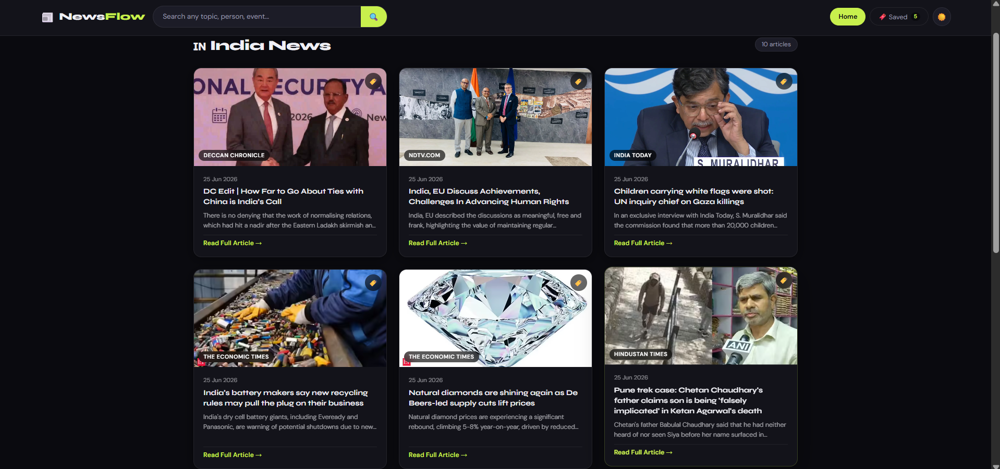
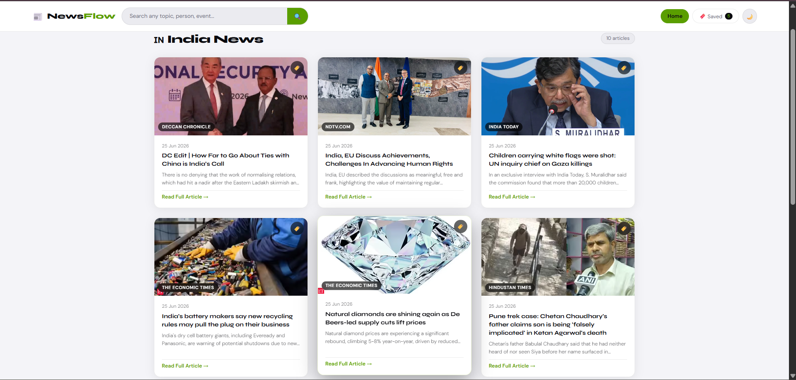
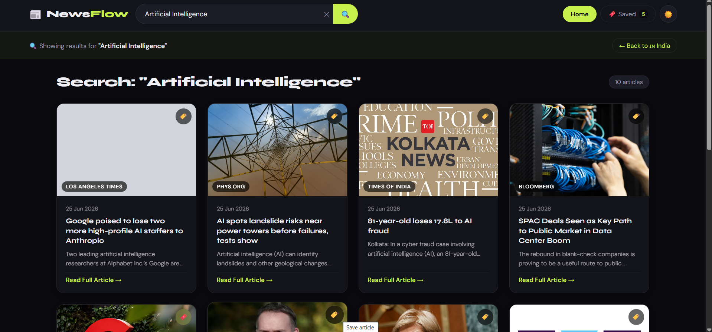
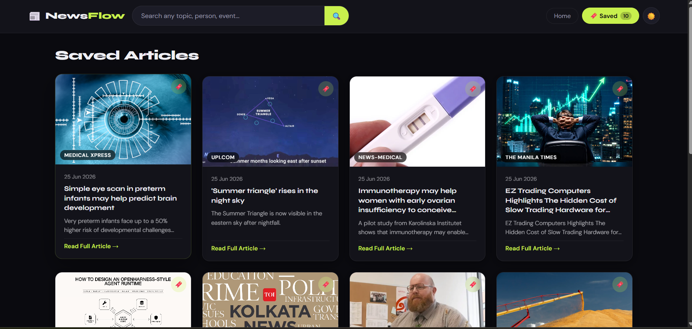

# 📰 NewsFlow

> A modern, responsive news aggregator built with React 18 and the GNews API — delivering real-time global news with category filtering, bookmarking, and dark/light mode.

🌐 **Live Demo** → [newsflow-tan.vercel.app](https://newsflow-tan.vercel.app)


---

## 📸 Screenshots

### 🌙 Dark Mode


### ☀️ Light Mode


### 🔍 Search Results


### 🔖 Saved Articles


---

## ✨ Features

| Feature | Description |
|---|---|
| 🇮🇳 India News | Top headlines from Indian sources |
| 🌍 World News | BBC, CNN, Reuters, Al Jazeera |
| 💻 Categories | Technology, Business, Sports, Entertainment, Health, Science |
| 🔍 Global Search | Search any topic, person, or event |
| 🔖 Bookmarks | Save articles with localStorage persistence |
| 🌙 Dark / Light Mode | Toggle between themes |
| ⚡ Skeleton Loaders | Smooth loading experience |
| 📱 Fully Responsive | Works seamlessly on all screen sizes |

---

## 🛠 Tech Stack

| Technology | Purpose |
|---|---|
| React 18 | UI framework |
| Custom Hooks | Reusable fetch logic (`useNews`) |
| GNews API | Real-time news data |
| CSS3 | Styling & animations |
| Vercel Serverless | API proxy (secure key handling) |
| localStorage | Bookmark persistence |

---

## 🚀 Getting Started

### Prerequisites
- Node.js v16+
- A free GNews API key from [gnews.io](https://gnews.io)

### Installation

```bash
# 1. Clone the repository
git clone https://github.com/sanjay-narra/newsflow.git
cd newsflow

# 2. Install dependencies
npm install

# 3. Create a .env file in the root folder
echo "REACT_APP_NEWS_API_KEY=your_gnews_api_key_here" > .env

# 4. Start the development server
npm start
```

App runs at → `http://localhost:3000`

---

## 📁 Project Structure

```
newsflow/
├── api/
│   └── news.js           ← Vercel serverless proxy (secures API key)
├── public/
│   └── index.html
├── src/
│   ├── components/
│   │   ├── Navbar.js
│   │   ├── CategoryBar.js
│   │   ├── ArticleCard.js
│   │   └── SkeletonCard.js
│   ├── hooks/
│   │   └── useNews.js    ← Custom hook for data fetching
│   ├── App.js
│   ├── App.css
│   └── index.js
├── screenshots/          ← App screenshots
├── .env                  ← API key (not committed)
├── package.json
└── README.md
```

---

## 🎯 React Concepts Demonstrated

- **`useState`** — UI state management
- **`useEffect`** — Side effects & data syncing
- **`useCallback`** — Memoized fetch function to prevent unnecessary re-renders
- **Custom Hook (`useNews`)** — Separation of concerns, reusable fetch logic
- **Conditional Rendering** — Handles loading, error, and empty states gracefully
- **Props** — Clean data flow between components
- **localStorage** — Client-side bookmark persistence

---

## 🔒 API Security

The GNews API key is never exposed to the client. All API requests are routed through a **Vercel serverless function** (`api/news.js`) which injects the key server-side, keeping it secure in production.

---

## 👨‍💻 Author

**Sanjay Narra** — Frontend Developer

[](https://github.com/sanjay-narra)

---

## 📄 License

This project is licensed under the [MIT License](LICENSE).